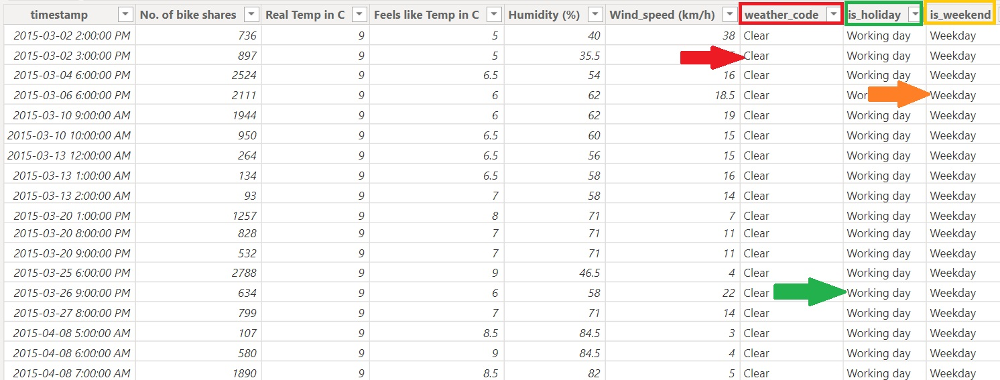
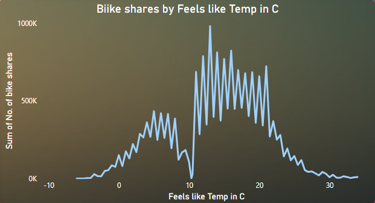
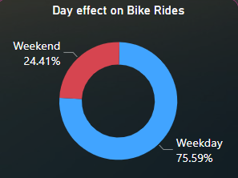
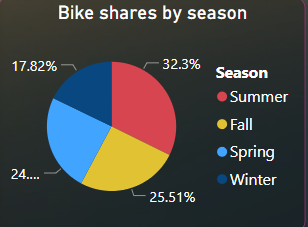
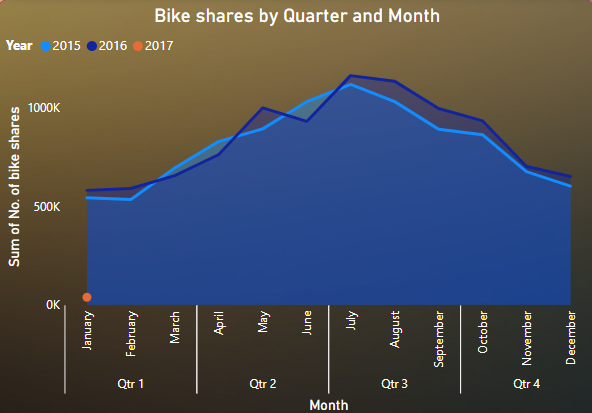
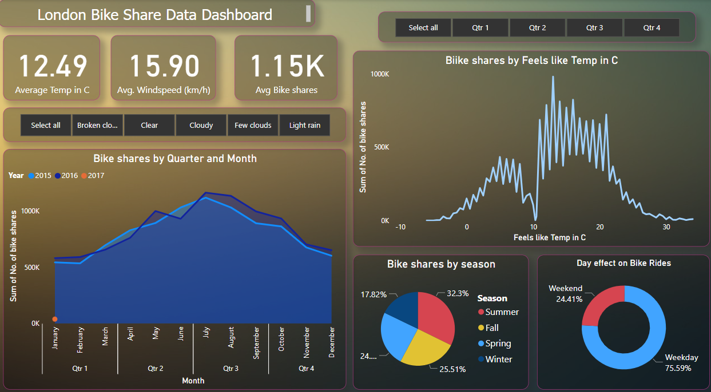

# PedalPulse Unleashing the Urban Cyclist's Journey
"PedalPulse" is a captivating repository housing the extensive London Bike Sharing Dataset. This repository offers a treasure trove of valuable information for urban cycling enthusiasts, researchers, and data scientists alike.

## 1. Project Overview
- The project aims to analyze and uncover valuable insights from the london city's bike sharing nexus. Through a comprehensive analysis, this project explores the patterns, trends, and factors influencing the no. of bike shares in london city in a year.
- By leveraging statistical analysis and exploratory data visualization the project aims to provide actionable insights to optimize business strategies and drive revenue growth. The project's focus is on understanding the effect of weather through out the year on the no. of bike shares and identifying key market trends to help improve decision-making processes in this industry.
- This project can be a reference point to the other countries across the globe who are looking forward to deploy the same model of shifting to bike share and ride model instead of selling bikes to the market.

## 2. Data Source
The data is acquired from 3 sources:
- (https://cycling.data.tfl.gov.uk/) Contains OS data © Crown copyright and database rights 2016 and Geomni UK Map data © and database rights 2019 Powered by TfL Open Data
- (https://freemeteo.co.uk/) - weather data
- (https://www.gov.uk/bank-holidays)
From 1/1/2015 to 31/12/2016

The data from cycling dataset is grouped by "Start time", this represent the count of new bike shares grouped by hour. The long duration shares are not taken in the count.

## 3. MetaData
- "timestamp" - timestamp field for grouping the data
- "cnt" - the count of a new bike shares
- "t1" - real temperature in C
- "t2" - temperature in C "feels like"
- "hum" - humidity in percentage
- "wind_speed" - wind speed in km/h
- "weather_code" - category of the weather
- "is_holiday" - boolean field - 1 holiday / 0 non holiday
- "is_weekend" - boolean field - 1 if the day is weekend
- "season" - category field meteorological seasons: 0-spring ; 1-summer; 2-fall; 3-winter.

- "weathe_code" category description:
  - 1 = Clear ; mostly clear but have some values with haze/fog/patches of fog/ fog in vicinity
  - 2 = scattered clouds / few clouds
  - 3 = Broken clouds
  - 4 = Cloudy
  - 7 = Rain/ light Rain shower/ Light rain
  - 10 = rain with thunderstorm
  - 26 = snowfall
  - 94 = Freezing Fog

## 4. Label Encoding
- This dataset has a lot of numnerical columns which can be further encoded to respective labels to get more insights out of it. As depicted from the metadata above, all the numerical values in the columns are replaced by the string values depicting their true meaning.
- A sample of label encoding is depicted below:
  

  

 

## 5. Exploratory Data Analysis (EDA)
- Now as the dataset is ready and loaded into model, I performed EDA to answer numerous questions which are vital to the business owner. 
- The following graphs gives a glimpse of the possibilities that can be answered in a very easy way so that the stakeholder can make informed decision.

### Ques1 What's the optimum temperature which contributes to max. no. of bike shares?

  

### Ques2. Is it a good decision to deploy bikes on weekends?

  

### Ques3. In which season shall we deploy more bikes in the streets?

  

### Ques4. Compare the no. of bikes shares from last year, quarterwise?

  

## 5. Interactive dashboard
- Finally, after answering numerous questions which impact the bike shares in a major way, an interactive dashboard comes to play.
- The dashbaord consists of 3 KPI's , 4 charts and 2 slicers.
- By selecting any weather type or quarter from the slicers in the dashbaord, the stakeholders can see how the business performed in respective categories.
- As the dashboard is interactive, it acts dynamically relating the query on one chart to all the charts in the dashboard.

  

## 6. Conclusion
- The key takeaway is that the max. no. of bike shares took place in the summer season, on weekdays having an avg. temp. of 12.49 celsius when the sky is clear with an avg windspeed of 15.90 km/hr.
- The bike shares by quarter and month compared to last year depicts the rise in no of bike shares from the previous year. It is safe to conclude that the business should deploy more bikes in the coming year following the above opitmum parameters of the weather.
- This leads to wise utilisation of the company's resources and taking data backed up informed decisions.
- This project can acts as a reference point for all the cities across the globe who are looking forward to deploy the same bike sharing model.
- The data sources are government authorised making this project and dashboard reliable for making decisions.
- This is the tip of iceberg of my skillset as data enthusiast. In this project, I tried to showcase my data analytical skills in a brief manner.
- Furthermore, I tried to showcase the calliber of PowerBI visualisation tool which helps in making interactive dashboards.
